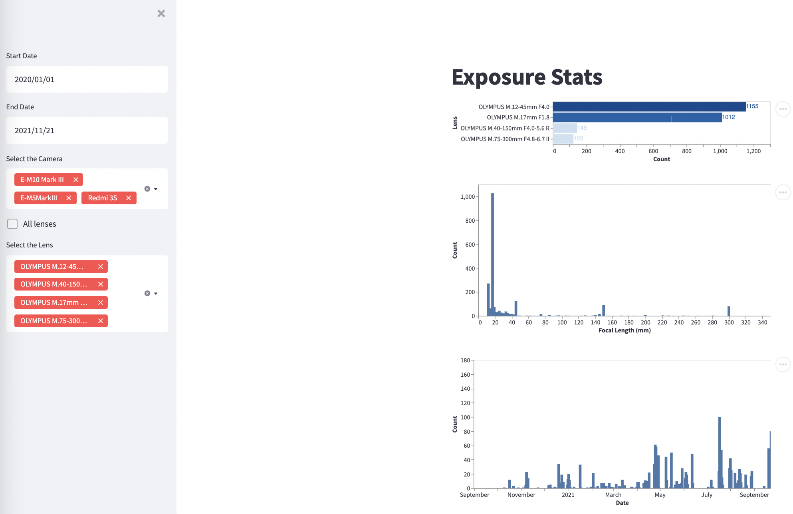

# ExposureStats

Streamlit App to show Exposure Image Editor Photo Stats.

## To install

pip install -r requirements.txt

pip install -e .

Recommended python version is python3.8

## Screenshot

## Comments

For the moment, reads a config file in the project dir.

Notebook folder has an older version, jupyter + seaborn based. 

## To Do

- Tests

- Package/Deploy as a container?

- Fix the  **key not in dict: '@alienexposure:lens'** error for some jpegs. This way they don't show up.

- Exposure X7 support?

- Bug when selected lens is empty

